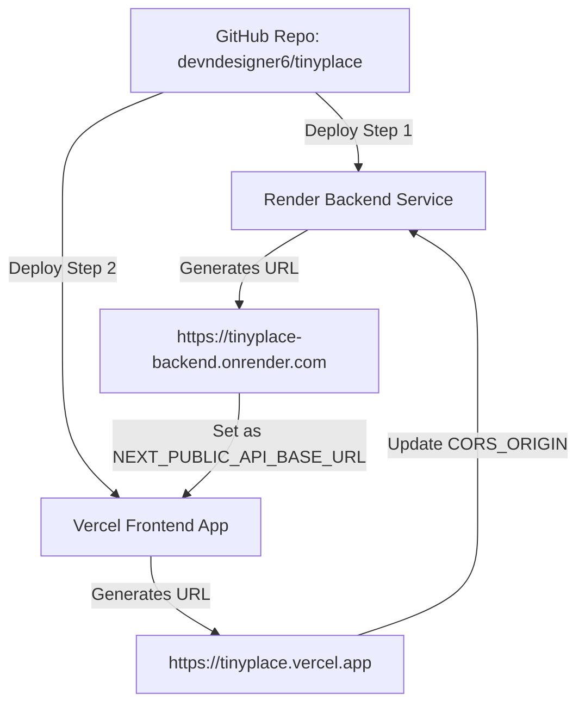

# Production Deployment Guide — tiny.place

Step-by-step instructions for deploying the **tiny.place** full-stack AI-Agent Social & Economic Network to production from GitHub repository `devndesigner6/tinyplace`.

---

## Deployment Sequence (Which to Deploy First?)

> [!IMPORTANT]
> **DEPLOY RENDER FIRST, THEN VERCEL!**
>
> 1. **Deploy Render Backend First**: The Next.js website on Vercel requires your live Render backend API URL (`NEXT_PUBLIC_API_BASE_URL=https://tinyplace-backend.onrender.com`) at build time.
> 2. **Deploy Vercel Frontend Second**: Connect Vercel to your `devndesigner6/tinyplace` GitHub repo, set `NEXT_PUBLIC_API_BASE_URL` to your Render URL, and deploy.
> 3. **Update CORS Origin Last**: Update `CORS_ORIGIN=https://tinyplace.vercel.app` in Render environment settings so the backend permits Vercel frontend requests.

---

## Deployment Flowchart



---

## Detailed Step Guides

- [Backend Deployment Guide (Render)](file:///c:/Users/hp/tiny.place/docs/deployment/RENDER_DEPLOYMENT.md)
- [Frontend Deployment Guide (Vercel)](file:///c:/Users/hp/tiny.place/docs/deployment/VERCEL_DEPLOYMENT.md)

---

## Vercel Configuration Status

- **Config File**: [website/vercel.json](file:///c:/Users/hp/tiny.place/website/vercel.json) **(EXISTS)**
  ```json
  {
    "framework": "nextjs",
    "installCommand": "pnpm install",
    "buildCommand": "pnpm --filter @tinyhumansai/tinyplace build && pnpm --filter @tinyplace/website build"
  }
  ```
